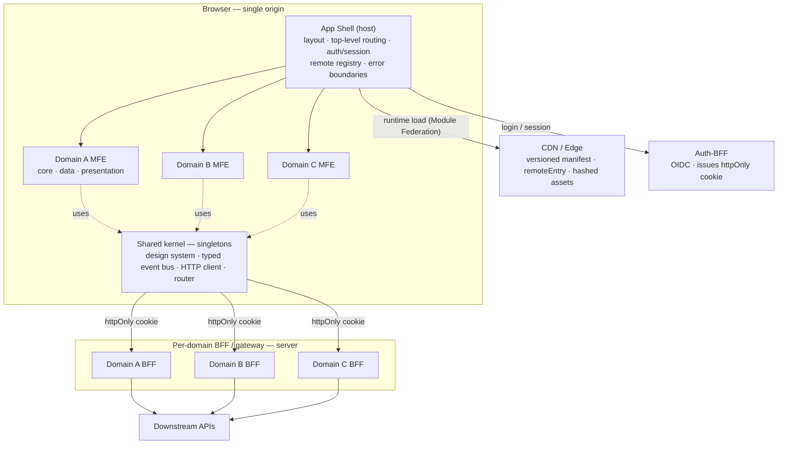
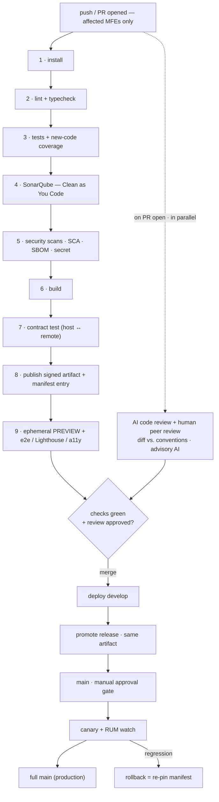

# Exercise 3 — Architecture Reasoning (AI-assisted)

> A scalable front-end architecture using **microfrontends (MFE)** + **DevOps**, covering
> scalability, maintainability, performance and security.
>
> **Context (generic):** an organization of ~5–8 autonomous teams, each owning an independent
> business **domain** (A, B, C…) of one web platform — the scale where microfrontends pay off.
> Built decision-by-decision; the full process is in the [roadmap](exercise-3-roadmap.md), and a
> plain-language **glossary** is at the end.

## Architecture at a glance

**In plain words:** a thin **shell** loads each team's **microfrontend** at runtime and renders them
together; all share one **design system** and a small **shared kernel** (event bus, HTTP client,
router). Login goes through a **BFF** that keeps tokens server-side — the browser only holds a cookie
it can't read.

## 1 · Microfrontend strategy

- **Split by domain (vertical), not by technical layer.** One MFE per business domain, owned
  end-to-end by one team; a typical change touches a single MFE.
- **Runtime integration with Module Federation (single framework).** Each MFE deploys on its own; the
  shell loads them at runtime and they **share singletons** (one React/router/design system) → small
  bundles. *(Build-time bundling would re-couple deploys; Native Federation is the path if the org
  ever needs multiple frameworks.)*
- **Client-side shell (CSR).** Simplest composition; SSR is added **only** for an MFE that needs SEO
  or breaks its speed budget.
- **Cooperate without coupling.** The shell owns top-level routing; cross-MFE signals travel via the
  **URL** and a **typed event bus** (no global shared state); **typed contracts + version checks**
  stop one team's change from silently breaking another.

## 2 · CI/CD pipeline

- **One pipeline per MFE**, on every push/PR, only for what changed.
- **Gates that block merge:** lint/types · tests + **coverage on new code** · **SonarQube** ·
  security scans · size/speed budgets · contract tests.
- **AI code review + human peer review** run **when the PR is opened**, in parallel with the
  validation pipeline (the AI review is advisory).
- **Environments `develop → release → main`:** build once, promote the **same artifact**; **main**
  needs manual approval; CI reaches the cloud with short-lived **OIDC** tokens; each team deploys
  only its own MFE.
- **Safe releases:** canary + feature flags; **rollback = point the manifest back one version**
  (seconds).

## 3 · Scalability · Maintainability · Performance · Security

- **Scalability** — teams ship independently; adding a domain = adding an MFE. Start in a monorepo;
  split a team to its own repo only when it needs full independence.
- **Maintainability** — hard boundaries (only shared contracts cross), the same internal structure in
  every MFE, decisions recorded (ADRs), rules enforced in CI (*fitness functions*).
- **Performance** — shared singletons; load each MFE only when its route opens (+ prefetch); CDN +
  cached immutable files; budgets enforced in CI.
- **Security** — all MFEs share one origin, so a single XSS could reach everything → contained by
  **CSP + Trusted Types**, **iframe isolation for untrusted third-party MFEs**, **BFF + httpOnly
  cookie** (token unreadable by JS), and supply-chain checks (pinned versions, signed artifacts).

## Key decisions (ADRs, one line each)

| # | Decision | Why |
|---|---|---|
| 000 | Context: generic multi-team platform; success = DORA + Core Web Vitals + fitness | measurable goals |
| 001 | Vertical MFEs (one per domain) + shell + shared design system | team autonomy, low coupling |
| 002 | Runtime **Module Federation**, single framework | independent deploys + shared singletons |
| 003 | **Client-side** app shell; SSR only as a trigger | simplest; SSR has a real cost |
| 004 | Shell owns top-level routes, MFEs own sub-routes | consistent navigation |
| 005 | No global store; URL + shell context + **typed event bus** | loose coupling |
| 006 | **Versioned** shared design system (singleton) | UI consistency, no duplication |
| 007 | Typed contracts + semver + contract tests + **runtime version check** | catch breaking changes |
| 008 | **BFF + httpOnly** cookie; CSP/Trusted Types; iframe for untrusted | strongest XSS posture |
| 009 | Error boundaries (bulkheads) + OpenTelemetry + **rollback by manifest re-pin** | contain failures, recover fast |
| 010 | Per-MFE CI/CD + gates + AI review; `develop→release→main`; progressive delivery | safe independent delivery |
| 011 | Shared singletons + lazy/prefetch + budgets + scaling triggers | performance held by budgets |
| 012 | Governance + **fitness functions** | prevent architectural drift |

## When NOT to use microfrontends

For a **single team or a small app**, a well-structured **modular monolith** is the better choice.
Microfrontends pay off only when **multiple teams need to deliver independently** — they add runtime
cost and a wider security surface.

## Glossary (plain language)

- **Shell** — the host page that loads and arranges the microfrontends.
- **Microfrontend (MFE)** — one team's slice of the app (a business domain), built and deployed on its own.
- **Module Federation** — technology that lets the shell load another team's code **at runtime**.
- **Singleton** — one shared copy of a library (React, router…) instead of one per MFE.
- **Shared kernel / design system** — common building blocks (UI components, HTTP client, event bus) used by all MFEs.
- **BFF (Backend-for-Frontend)** — a small server that holds your tokens and calls the APIs for you.
- **httpOnly cookie** — a cookie JavaScript **cannot read** → safe from XSS theft.
- **CSP / Trusted Types** — browser rules that block injected (XSS) scripts.
- **Manifest** — the list of which version of each MFE to load; **rollback** = change a number here.
- **Canary** — release to a few users first; if healthy, roll out to everyone.
- **OIDC** — a login standard; here it gives CI **short-lived** cloud access instead of stored keys.
- **DORA / Core Web Vitals** — how well/fast a team ships / user-experienced page-speed metrics.
- **Fitness function** — an automated test of an architecture rule (e.g., "no MFE imports another's internals").

## AI prompts used (transcription)

Built with a **Socratic method**: the AI (as a senior architect) laid out the options and a
recommendation at each step; the **human made every decision**. Key prompts, in order:

1. *"Exercise 3: design a scalable front-end architecture with microfrontends and DevOps — MF
   strategy, CI/CD design, scalability/maintainability/performance, and the AI prompts used."*
2. *"Follow the same formula (open loops · happy path · edge cases · errors), create the roadmap, act
   as a 10-year expert, and decide each step Socratically."* + *"Add security."*
3. *"This is a separate exercise — keep it generic, start from zero."*
4. Decisions: *vertical per domain + shell + design system* · *runtime Module Federation* · *CSR
   shell* · *contracts OK* · *"go with BFF + httpOnly"* · *"name the environments develop, release,
   main."*
5. Clarifications: *one shared HTTP client, not one interceptor per MFE* · *Grafana fits as the
   dashboard layer over OpenTelemetry* · *"explain each term simply"* · *"the AI review should run
   when the PR is created"* (in parallel with validation).

> The AI proposed options and trade-offs; the human set the context and every decision.
